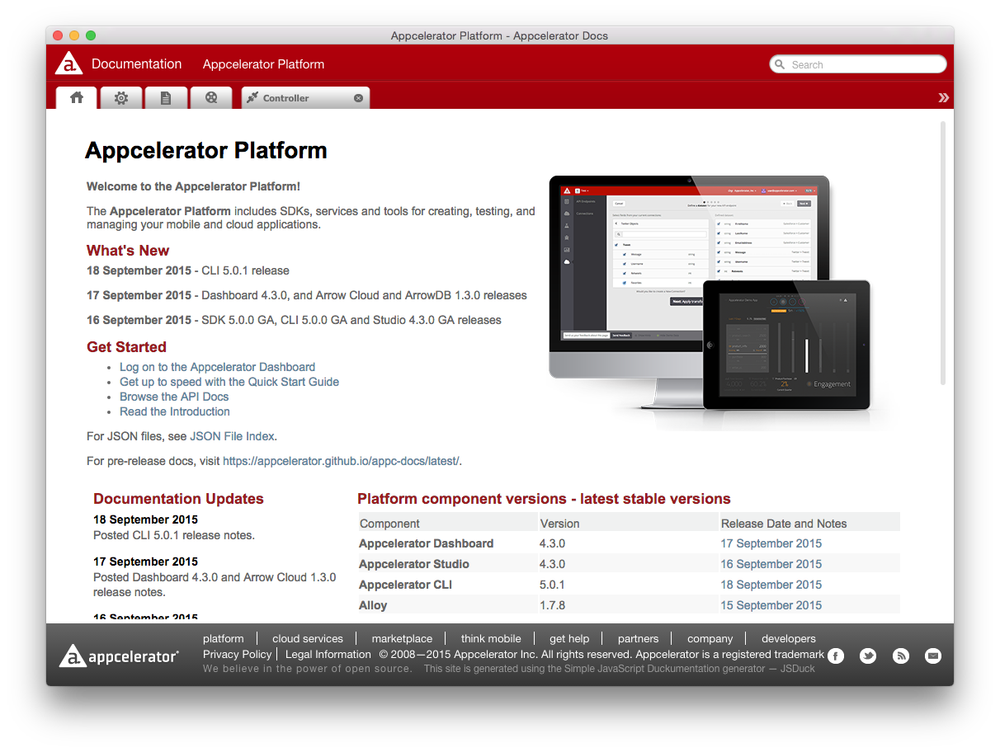

# Appcelerator Documentation for Desktop
Desktop Application for Mac, Windows and Linux to use the [Appcelerator Documentation](http://docs.appcelerator.com) offline. Uses GitHub's [Electron](http://electron.atom.io/).

## Install

Get the installers via [Releases](https://github.com/appcelerator-developer-relations/appc-docs-desktop/releases).

## Build
Instructions to update and build the app from source.

### Prerequisites

* Max OS X
* NodeJS 0.12
* Wine:
	
		brew update && brew upgrade
		brew install Caskroom/cask/xquartz
		brew install wine makensis

### Steps

1. Clone (a fork of) this repository
2. Install dependencies: `npm install`
3. Run `npm run build` to download the latest CI docs, build the apps and create the installers
4. Create a release and attach the files in [dist](dist).

## Test
You can use `node build <step>` to run individual steps of the build process when you are debugging errors.

## License
See [LICENSE](LICENSE).